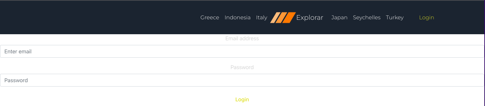

# Explorar - Project 3

## Description

This application utilizes the full MERN (MongoDB, Express, React.js, Node.js) stack, and allows users to view the 6 different countries below to search for the following criteria:
- Culture 
- Hotels 
- Flights

Countries:
- Indonesia (Bali)
- Greece (Mykonos)
- Italy (Lake Como/Rome/Portofina)
- Seychelles
- Japan
- Turkey (Istanbul/Cappadocia)

## Table of Contents

- [License](#license)
- [Installation](#installation)
- [Usage](#usage)
- [Credits](#credits)

## License

## Installation

Upon downloading the application, run the "npm i" command in your terminal to stall the correct libraries.

## Usage

- LIVE LINK

- Navigate to the login button on the top right of the screen to either create an account, or login. 

## Credits

- Lucas Saaler - https://github.com/Lucas-Saaler
- Anisa Ali - https://github.com/Onaysa
- Marilyn Ventura - https://github.com/arutneva
- Jordan Heidlage - https://github.com/jordanheidlage